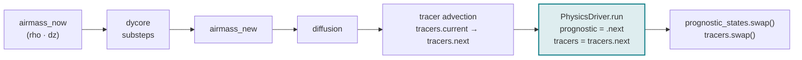
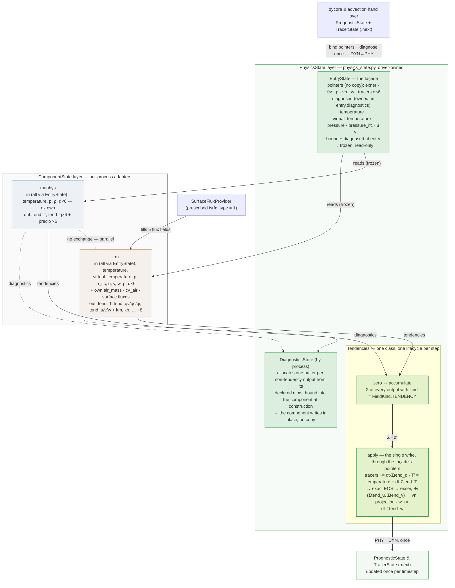

> **TL;DR** The physics interface **as currently implemented** in PR #1436
> (now based on `main`; #1360 stacks tmx on top of it): two layers of state
> under **parallel process coupling**. The driver-owned **PhysicsState layer**
> (`physics_driver/physics_state.py`) is the only code that touches the model
> state — its `EntryState` façade binds pointers and diagnoses the physics
> fields once per step, tendencies accumulate across processes, and one apply
> step writes everything back (ICON's dyn2phy/phy2dyn, each exactly once). The
> per-process **ComponentState layer** only computes. muphys (graupel
> microphysics) and TMX (turbulent mixing) are the two plugged-in components.
> **Validated:** the APE_AES v08 driver datatest passes in assert
> mode with measured tolerances.

> **Relation to other notes:** this documents the *as-built* state.
> [[personal/OngChia/physics-driver-and-components|Physics driver and component design]]
> proposed StateView / per-field freshness / driver-side consistency checks — the
> `EntryState` façade and the metadata-driven routing implement the spirit of
> several of those points.
> [[personal/msimberg/revive-components/revive-components|Revive components]] and
> [[personal/jcanton/model-state/model-state|Model state]] discuss the
> `Component`/state protocols this design builds on.
> [[personal/jcanton/jsbach-port/jsbach-port|JSBACH port]] is where the land-tile
> side of the TMX surface fluxes would eventually come from.

## 1 · Where physics runs in the time step

The `PhysicsDriver` is one granule in the driver's `_integrate_one_time_step`
(package `model/driver` — main renamed it back from `standalone_driver`). It
operates on the `.next` time level *after* dynamics, diffusion, and tracer
advection, *before* the swaps — ICON's fast-physics convention. Processes are
scheduled on the step-start date (`datetime_new − dt`, as in
`mo_interface_iconam_aes`).



Call site (unchanged by the refactor — the raw model state appears **only** here):

```python
granules.physics.run(
    prognostic=prognostic_states.next,
    tracers=tracers.next,
    dtime=config.driver.dtime,
    simulation_current_datetime=...,
)
```

## 2 · One driver step under parallel coupling

Every process computes its tendencies from the **same frozen step-entry
state**; the summed tendencies are applied once, after all processes. There
are no provisional updates between processes and no copies anywhere.

```mermaid
sequenceDiagram
    participant D as PhysicsDriver.run
    participant E as EntryState (façade)
    participant P1 as PhysicsProcess<br/>muphys
    participant P2 as PhysicsProcess<br/>tmx
    participant T as Tendencies
    participant M as model state (.next)

    D->>E: compute_diagnostics(prognostic, tracers)
    Note over E: bind pointers (exner, θv, ρ, vn, w, tracers)<br/>diagnose into entry.diagnostics — ONCE:<br/>temperature, virtual_temperature, pressure, pressure_ifc, u, v
    D->>T: zero()
    D->>P1: run(entry, step_start, dtime)
    Note over P1: the process decides: in window?<br/>firing step, or reuse its cached output?
    P1-->>D: outputs (tend_* + precip diagnostics)
    D->>T: accumulate(outputs, outputs_properties)
    Note over T: kind == FieldKind.TENDENCY → summed here;<br/>everything else was written in place into<br/>the DiagnosticsStore buffers bound at construction
    D->>P2: run(entry, step_start, dtime)
    Note over P1,P2: no exchange — parallel:<br/>both read the same frozen entry state
    P2-->>D: outputs (tend_* + km, kh, …)
    D->>T: accumulate(outputs, outputs_properties)
    D->>M: apply(entry, dt) ONCE, through the façade's pointers
    Note over M: tracers += dt·Σtend_q ·<br/>T′ = temperature + dt·Σtend_T → exact EOS → exner, θv ·<br/>(Σtend_u, Σtend_v) → vn projection · w += dt·Σtend_w
```

The driver loop is exactly this, and nothing else:

```python
self._entry.compute_diagnostics(prognostic, tracers)
self._tendencies.zero()
for process in self._processes:
    outputs = process.run(self._entry, step_start_datetime, dtime)
    self._tendencies.accumulate(outputs, process.component.outputs_properties)
self._tendencies.apply(self._entry, dt_seconds)
```

**Deliberate deviation from ICON:** AES couples mig/vdf *sequentially* — each
process sees the previous one's provisional update, which requires working
tracer buffers and a per-step value copy (`mo_interface_iconam_aes.f90:216/343`,
apply at `:513`). We chose parallel coupling (2026-08-18): no copies, no
inter-process data dependency (processes could in principle run concurrently),
and re-adding sequential later is a contained change (provisional advance +
working-q machinery). The measured cost of this deviation vs the sequentially
generated v08 reference is far below the other residuals.

## 3 · The pieces and who implements what

The whole design in one picture — thin edges are reads, the thick chain at the
bottom is the only write path; the green boxes are the PhysicsState layer, the
process boxes the ComponentState layer:



**PhysicsState layer** — `physics_driver/physics_state.py`, driver-owned, the
only writer of the model state:

| Piece | Role |
| --- | --- |
| `EntryState` | binds *pointers* to `exner, theta_v, rho, vn, w, tracers` (same memory, physics names) and owns the six diagnosed fields, grouped in the common `DiagnosticState` as `entry.diagnostics.{temperature, virtual_temperature, pressure, pressure_ifc, u, v}`. `compute_diagnostics` runs once per step; frozen afterwards. |
| `Tendencies` | One class for the whole tendency lifecycle: `zero` → `accumulate` once per process → `apply`. The sums are lazily allocated per variable, over every output with `kind == FieldKind.TENDENCY`. `apply` is the single write: tracers, ONE exact-EOS exner/θv update from the summed T-tendency with the final moisture, ONE cells→edges wind projection, w. All existing stencils, each once. |
| `DiagnosticsStore` | `driver.diagnostics[process_name][output]` — every non-tendency output, by the complement rule. Allocates each buffer from the output's declared `dims` at driver construction and hands it to the component via `bind_output_buffers`, so granules write in place and still run standalone in their own datatests. Keyed per process (unlike ICON's flat `field%`) for order-independence and collision-safety. |
| `PhysicsProcess` | component + state adapter + `ProcessTimeControl`. Its `run` owns the per-step decision: outside its window it returns nothing; on a firing step it computes; between firings it returns its cached output. |

**ComponentState layer** — one adapter per process, protocol
`common/components/component_state.py` (renamed from `physics_state.py` — the
name deliberately moved to the driver package). **One method, no storage**:

```python
class ComponentState(Protocol):
    def as_component_input(self, state: Any) -> dict[str, Any]: ...
```

It is called only on a step where the component actually computes, so a
derivation placed here never runs for a step whose result is discarded.

`muphys.state.State` is a pure input mapping (its only owned field is `dz`).
`tmx.state.State` adds the two tmx-specific derived inputs (`air_mass`,
`cv_air`) and hosts the surface-flux provider seam. Components never see
`PrognosticState.exner` — only `entry_state.exner`.

### Layering — a dependency-direction story (enforced by tach)

`physics_driver` depends only on `common` (the shared stencils it needs —
`compute_vn_from_uv`, the edge-apply — were relocated to common accordingly).
The process packages depend on `common`; the driver package (`model/driver`)
wires everything. The `ComponentState` protocol lives in `common` so the
process packages never import `physics_driver`.

## 4 · What happens per process, per time step

`PhysicsProcess.run` (component + ComponentState adapter + time control) decides,
for each process, in this order:

1. Outside its `[start, end)` window it returns nothing and contributes nothing.
   A process that should not run at all is simply left out of the driver's
   process list, so its component is never constructed and its stencils are
   never compiled.
2. On a firing step: `state.as_component_input(entry)` — derive process-specific
   inputs (tmx: air_mass, cv_air, run the flux provider) — then compute. Between
   firings it returns its cached output, and the input translation is skipped
   with it.
3. The **driver** hands the outputs to `Tendencies.accumulate`, which keeps those
   with `kind == FieldKind.TENDENCY`. Everything else is a diagnostic and was
   already written in place into the `DiagnosticsStore` buffer bound to that
   component. The metadata finally *does* something (the old B2 thread) — and the
   adapters contain zero application code.


## 5 · What each component collects, computes, and emits

|  | muphys (graupel microphysics) | tmx (turbulent mixing) |
| --- | --- | --- |
| as_component_input | pure mapping; nothing computed (`dz` static) | computes air_mass (ρ·dz), cv_air (moisture-weighted); runs the **surface-flux provider** (prescribed `isrfc_type = 1` fluxes — ≈ −83 W/m² sensible, zero latent; ocean bulk fluxes later for `isrfc_type = 0`) |
| component inputs | 4 + 6 tracers (dz, te, p, rho, q_v..g) — all but dz via `entry_state` | 21 (thermo + wind + tracers + air_mass/cv_air + 5 surface-flux fields) — all but its own via `entry_state` |
| component outputs | `tend_temperature`, `tend_q*` (6) → accumulators; precip fluxes (pflx, pr, ps, pi, pg, pre) → diagnostics store | `tend_temperature`, `tend_qv/qc/qi`, `tend_u/v/w` → accumulators; km, kh, heating, dissip_ke + 4 vertical integrals → diagnostics store (no `kind` at all — diagnostics are the complement of `TENDENCY`) |
| applies | **nothing** — application is the layer's job, once, for everyone | **nothing** |
| naming | `tend_*` on the wrapper contract; granules keep their port names (`TENDENCY_GRANULE_PORTS` maps) | same |

## 6 · Open design threads

> Expanded discussion agenda in
> [[personal/Yilu/physics-interface-discussion-points|Physics interface — discussion points]]
> (trimmed to the still-open items).

- **Metadata now drives behavior.** `kind` routes every output (accumulate vs
  store) — the "declarative only" gap is closed. Still open: validating the
  state↔component *input* key agreement (`as_component_input` vs
  `inputs_properties`) in the driver.
- **EntryState — make the prognostic/diagnostic split structural.** The physics
  `EntryState` (#1436) still mixes two categories on one object: six *pointers*
  for prognostic fields (`exner, theta_v, rho, vn, w` and tracers) and the owned
  diagnostics, now at least grouped under `entry.diagnostics` (a common
  `DiagnosticState`, diagnosed once per step, frozen). The pointers remain flat
  attributes, so the distinction is still partly a matter of comments.
- **Next components.** The ocean bulk-flux scheme (`isrfc_type = 0`: Louis
  exchange coefficients over a prescribed SST) behind the same surface-flux
  seam — see [[personal/jcanton/jsbach-port/jsbach-port|JSBACH port]] for the
  land side — then radiation (classically parallel-coupled) for the full
  aquaplanet.
