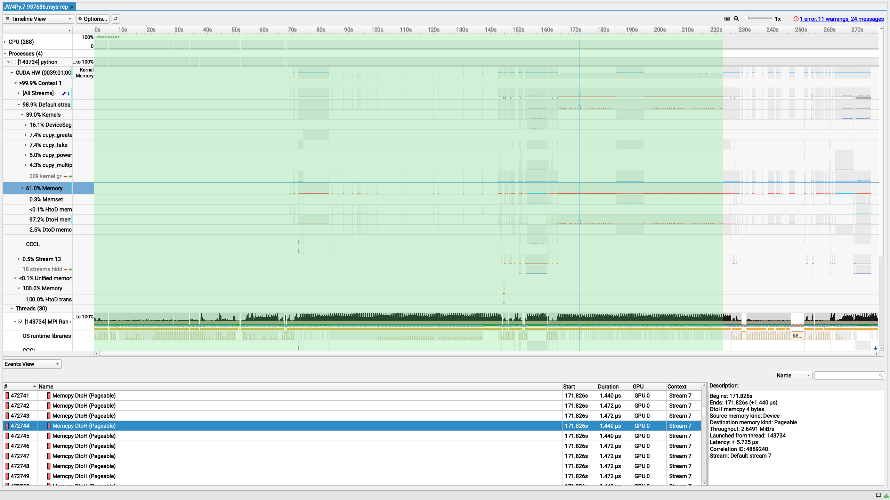

> **TL;DR** I have noticed that there are lot of small (4 byte) DtoD, HtoD and DtoH memory copies in the beginning of the standalone driver. The goal of this project is to eliminate or reduce them as much as possible.

## Problem / motivation

The `standalone-driver` of `icon4py` (for the JW experiment at least) seems to be doing a lot of pack and forth with GPU memory that consumes a lot of time before the actual `dycore` execution.
See the example below:

The selected area with `green` shows the time spent in anything before `DaCe` calls that suggest `dycore` execution.

## Proposal

Figure out where these copies come from using `NVTX markers` in `Python` and eliminate/reduce them.

## Alternatives considered

Do nothing until this is a problem.

## Open questions / conflicts

Still have to figure out how to make this work with newer `Nsight Systems`.
