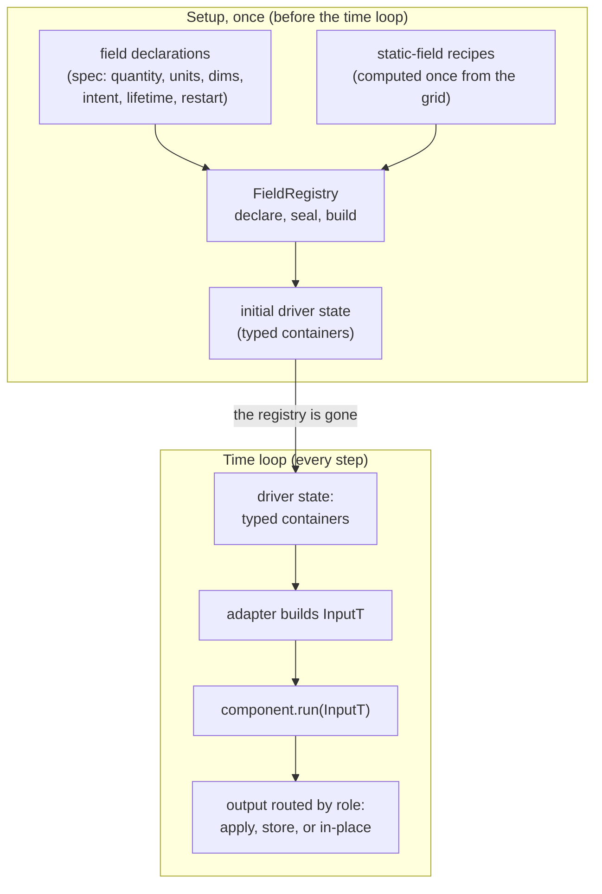
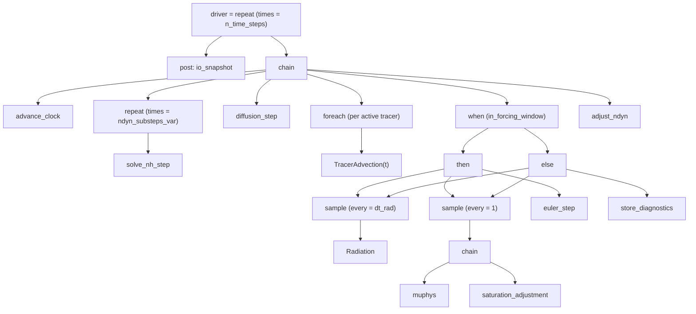
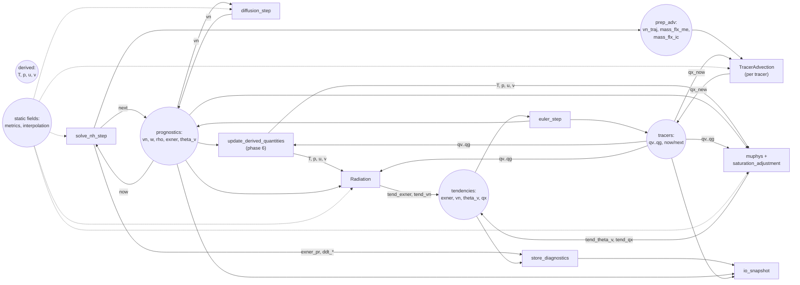

> **TL;DR** A synthesis of the open proposals for how icon4py components and
> model state should work. Four parts: every field declares itself once, every
> component is a typed box with a single `run(state)` method, the driver is a
> short list of steps, and setup builds the typed containers from the
> declarations. The loop's results stay bit-identical while its structure
> becomes a short composition. The work is adopted in phases.

> **Implementation status (2026-08-10):** phases 1-6 below are implemented on
> branch
> [`components-one-more-try` of msimberg/icon4py](https://github.com/msimberg/icon4py/tree/components-one-more-try)
> (see "Code landmarks" below for file/line references). The branch tip is
> `8e9ab21503`; older landmark links are pinned to the earlier state of the same
> branch. Phases 1-6 are bit-identical to the old wiring on
> EXCLAIM_APE_AES (golden outputs recorded from the pre-change driver, `gtfn_cpu`,
> `atol=0`, `rtol=0`). Two pieces of part 4 diverge as built: `adopt` was removed
> (zero callers; the bindings construct the typed boundary directly), and the
> epoch/generation staleness counters exist but are a test-only defensive guard
> (production never bumps them). Both are marked inline below.

## The problem

icon4py's components (dycore, diffusion, advection, physics) each have their own
call signature, and the fields they need are wired by hand.
`driver_utils.initialize_granules` turns factory outputs into nine granule
containers (granule is the term icon4py uses for a component implementation)
with roughly 90 hand-typed keyword mappings. That mapping is replicated in
seven more places: five test sites and the two Fortran binding wrappers.

The wiring has already produced real bugs:

- The dycore accumulated trajectory fields into `PrepAdvection` while advection
  read a second, freshly allocated container, so standalone-driver tracer
  advection ran on identically zero input. Fixed in July 2026 by
  [PR 1404](https://github.com/C2SM/icon4py/pull/1404) with a hand-written
  aliasing function and an identity test. The fix is extra code that must be
  maintained; the bug class is still there.
- Wrong-key bugs in the replicated mappings (a `fac1` value into a `fac2` slot,
  an edge normal into a tangent slot) type-check and run.
- Derived quantities (temperature, pressure, u, v) are computed in three or more
  places with different hydrometeor inputs and different halo treatment. The
  temperature written to output is not the temperature physics computed with.
- Adding one field to a state container means editing the same hand mapping in
  several packages.
- Static fields (metrics, interpolation coefficients, geometry) come from a
  factory with its own provider taxonomy and dependency DAG, then land in the
  same hand-wired containers.

The pattern behind most of them: these defects are wiring or declaration
defects, decided once, before the time loop starts, rather than per-timestep
computation errors. So the fix belongs at setup time: declare fields and
components once, and let setup build the typed containers the granules already
take. Two of the defects, the derived quantities computed divergently, are
runtime computation problems; the fix is still a declaration, one derivation
with one set of inputs, but it runs every timestep, and the runtime
consequences are discussed below.

Four incompatible designs for this are open at once (PR 1301/1360,
egparedes' layered-architecture refactor, msimberg's revive-components specs, and
OngChia's physics driver design; see "Where the pieces come from"). This
document merges the four into one design. If PR 1301/1360 land first, their
dict adapter is replaced by the typed protocol in phase 3; their call-frequency and
consistency-check ideas carry over as the `sample` and the `seal` checks.

One framing point before the design: nothing in today's codebase is treated as
a constraint. icon4py is pre-stable, and the goal is the correct shape for the
future. Signatures, container shapes, names, package layout, and the driver
structure are all up for redesign. The real constraints are three. First,
gt4py's program-argument rules: a dict can never cross a stencil boundary, and a
`gtx.program` argument must be a dataclass without defaulted fields. Second, the
Fortran-embedded ABI: running icon4py components inside the ICON Fortran model
means flat pointers, and ICON owns the memory. Third, the physics itself,
meaning the stencils and their numerics. "How to get there" shows a
realistic transition from today's shape to this one; the design itself is not
shaped by what exists today.

## The design in four parts

### Part 1: every field declares itself once

Every field that a component reads or writes carries a small declaration at its
definition site. `spec(...)` is a thin wrapper over
`dataclasses.field(metadata=...)` that adds no default value. The no-default
rule matters: gt4py only accepts a dataclass as a program argument if every
field has no default, and a dict can never be one, so the design necessarily
ends in explicit typed dataclasses. The closed categorical facts (`intent`,
`lifetime`, `role`) are plain `Enum`s, not `StrEnum`s, on purpose:
`Intent.WRITE` is not equal to the string `"write"`, so a leftover bare-string
comparison fails loudly at import instead of silently passing. Silent
equivalence between "the declared vocabulary" and "some string a caller typed"
is exactly the bug class this design exists to remove.

```python
@dataclasses.dataclass(frozen=True)
class PrepAdvection:
    vn_traj: gtx.Field = spec(quantity="vn_traj", units="m s-1",
                              dims=(EdgeDim, KDim), intent=WRITE)
    mass_flx_me: gtx.Field = spec(quantity="mass_flx_me", units="kg m-1 s-1",
                                  dims=(EdgeDim, KDim), intent=WRITE)
```

What the declaration carries, and why:

- `quantity` is the canonical name. One quantity has exactly one name, one unit,
  one placement. An unprefixed name claims a CF standard name (the controlled
  vocabulary of the CF conventions); a field with no
  CF equivalent must use the `icon:` namespace (for example
  `icon:exner_function`). Registration enforces both directions. The ICON-sc
  exploration, a prototype for this codebase with no production use, counted
  18 CF and 72 `icon:` names in its own inventory: most of an atmospheric model
  has no CF name, and pretending otherwise is where today's vocabulary fragments
  (five parallel namespaces per field).
- `units` is one canonical unit per quantity, checked at setup, never converted
  at runtime. Conversion happens only at file boundaries, where the cost is paid
  once.
- `dims` is the placement (cell, edge, vertex, full or half levels), one source
  of truth. Today placement is recorded three times (name string, dims tuple,
  an `is_on_half_levels` flag) and the three have already disagreed.
- `intent` (read, write, or both) answers "who writes this field?"
  mechanically. Nobody records it today. It is the input to future halo-exchange
  derivation, and on restore it is what the restart workstream needs to
  re-exchange halos.
- `lifetime` (static, persistent, or scratch) separates fields computed once
  from state that lives across steps from granule-private temporaries. Scratch
  fields can be elided by the compiler; a shared container without a lifetime
  tag makes memory strictly worse.
- `restart` is a per-field flag. Whether a field is checkpointed is a property
  of the field, not of the container it sits in: some diagnostics must be
  checkpointed (the dycore's `exner_pr`), some prognostics need no halo, most
  fields need neither. The current prognostic/diagnostic split cannot express
  this, and the restart prototype is forced to hand-pick fields by name. Two
  consequences follow from the alternative synthesis. First, if restart ships
  first with a hand-picked field list, that list silently becomes the role
  vocabulary and conflicts with what this design declares, so declaring
  `restart` at the definition site has value even before the writer exists.
  Second, restart must allocate fields that a fresh process has no live copy
  of, which only works if `dims` is declared once, resolved through one
  object, not read back off a live field.

Static fields are ordinary fields with `lifetime="static"`: computed once at
setup, read-only afterwards, never restarted. What distinguishes them is only
how they come into existence. A static field has a declared recipe, a
function or gt4py program over the grid and other static fields, with explicit
dependency names; the registry resolves the recipe DAG once at setup, memoized
per (grid, vertical grid, backend). Static fields read from outside
(topography, external parameters, buffers Fortran already computed) are
adopted instead of computed. The mechanics are in Part 4.

The container a field sits in is just a grouping; the declaration is the
semantics. That is the point of declaring fields by quantity: which container
holds a field stops carrying meaning, and merging or splitting containers
becomes a cheap choice rather than a wiring change.

This is the mechanism NDSL/Pace, the other GT4Py-based model, ships today:
rigid dataclasses with field metadata, allocated by a generic walk of
`dataclasses.fields`. This design adopts that shape.

### Part 2: every component is a typed box

A component is a class with one method:

```python
class Component(Protocol[InputT, OutputT]):
    def run(self, state: InputT) -> OutputT: ...
```

`InputT` and `OutputT` are frozen dataclasses whose fields carry the declarations
from part 1. The component receives exactly the fields it named, never a global
state object. Static fields are inputs like any other: a scheme that needs
`geofac_div` declares it in `InputT`; the registry computed it once at setup,
and the component only ever reads it. Time is part of the input: a small
`StepInfo` (timestep,
simulation time, substep index, first/last flags) is a field of `InputT` when a
component needs it, set by the driver's loop, not a keyword argument. The time
step `dtime` is a declared input field too, not a positional argument: the few
components that need it (the dycore, the apply-tendency glue) declare it like
any other input. This keeps one entry point per component and lets a component
run unchanged whether called directly in a notebook or wired into a composed
run. That
removes the dycore's `at_first_substep` and `at_last_substep` flags; the
remaining control flags (`lprep_adv`, `is_iau_active`, `iau_wgt`) are left open
(one `LoopContext` field vs. individual fields, see the open questions).

The output dataclass type declares what the component changed, per field,
through the field's `role`. The role says what the framework does with the
field once the component returns: applies it, stores it, or does nothing,
because the component already mutated it in place.

- `role="tendency"`: a rate an explicit apply step adds to the prognostics
  (physics returns tendencies, per icon4py's accepted ADR 0001);
- `role="diagnostic"`: stored, never applied;
- `role="in_place"`: the component mutated the buffer it was handed, the
  majority idiom (the dycore, diffusion and advection all write into their
  inputs). Returning the output instance is optional; the type is what the
  framework reads.

Physics components write only tendencies and diagnostics; a contract test
asserts the prognostics are unchanged before and after. This keeps ADR 0001
intact and reconciles the "physics returns tendencies" rule with the in-place
majority: both are declared roles on output fields, not two mechanisms.

A component is a scientific scheme (dycore, diffusion, advection, a microphysics
scheme, radiation), not a stencil. Stencils stay inside components. The boundary
is drawn where a scientist might plausibly swap or reorder something: the
component lives at the composition layer, the stencil is the unit of
scheduling below it. (This two-granularity idea comes from the ICON-sc
exploration.)

### Part 3: the driver is a short list of steps

The time loop is written as a small composition over components, five
combinators, each mapping to something the driver already does:

- `chain`: run these in order;
- `repeat`: run a step N times (the dycore substeps; the count can be
  runtime-varying, as `ndyn_substeps_var` already is). `repeat` owns the
  current-to-next swap of the double-buffered prognostics;
- `when`: choose between two steps (the physics window: apply or diagnose);
- `foreach`: run one branch per item (one advection branch per active tracer);
- `sample`: run a step every N timesteps and reuse the last result in between.
  This replaces the physics driver's recycle cache, and with `when` it replaces
  `ForcingMode` entirely (today's apply-or-diagnose switch): applying and
diagnosing are two explicit chains.

The names follow established usage. `chain` is the established name for
ordered steps: LangChain's LCEL made it mainstream in machine learning, and
the chain-of-responsibility pattern is a classic; the ICON-sc exploration used
it the same way. The alternatives were considered: `pipe`
(Ramda, RxJS) and `compose` imply a value flowing from step to step, which the
shared-state semantics does not have. `sequence` (PyTorch, Haskell) reads as
ordering data rather than executing steps. `then` would collide with
`when`'s keyword. `when` is the conditional-execution
combinator of Haskell's `Control.Monad`; `sample` has the same semantics as
RxJS's `sample` operator (emit the most recent value when the notifier fires)
and matches how modelers describe physics called at intervals; `foreach` is
Metaflow's and C#'s construct for one branch per item; `repeat` is
`replicateM`. The obvious name for per-item fanout would be `map`, but in an
atmospheric model `map` already means horizontal mapping, so `foreach` carries
that role. This is a minimal basis: a multiway `switch` and a `while`/`until`
are not needed by today's driver and can be added when a real need appears.

Each component is adapted into a step. The adapter builds `InputT` from the
state the driver threads. That state is a small declared set of containers:
prognostics, diagnostics, tendencies, and coupling fields, the values exchanged
between components such as the dycore-to-advection trajectory fields. The
adapter calls `component.run` and routes the output by role. Components never
see the driver state; no component
receives it. A step can also be given a snapshot of the driver state at step
start: the adapter then builds `InputT` from the snapshot, so the component
sees the state as it was before the step, the Jacobi variant. The default
sequential chain, where each component sees what the previous one wrote, is
the Gauss-Seidel variant. As built, the physics driver makes both expressible
via a `PhysicsCoupling` knob on `PhysicsDriver`/`build_physics_composition`
(commit `8e9ab21503`): SERIAL (Gauss-Seidel, the validated default) interleaves
each process's compute and apply; PARALLEL (Jacobi) runs every process's
compute against the frozen step-entry state and defers all applies to after the
last compute. Both shapes come out of the same process-phase decomposition, so
the schedule alone is a reordering; what the Jacobi shape does **not** yet do
is the single accumulated apply of C2SM/icon4py PR #1436 (per-variable summed
`TendencyAccumulators`, one exact-EOS write back) - that needs additional
accumulator buffers, noted in the enum docstring as the open extension.

The driver becomes legible: which schemes, what order, what cadence, where
output happens, all on one screen. This is the shape of the legible run script
proposed in the revive-components v3 spec, with one difference: v3's steps
share a mutable carry that components reach and mutate, and here components
receive only their typed input. The ICON-sc exploration pursued the same idea.

A scoping note: none of the catalogued defects is a driver-authoring problem.
The composition's payoff is legibility and reordering (a scheme experiment, a
second physics package), not fixing the wiring defects catalogued above. It is
therefore the most deferrable piece of this design and sits last in the
adoption order; the alternatives to it are discussed in "How to get there".

The composition is introspectable: every step declares its inputs and outputs,
components through their `InputT`/`OutputT` declarations and combinators
through their structure, so `driver.show()` or a graphviz dump is a reading of
the declarations, not extra bookkeeping. Two views fall out of the same
declarations. The first is the composition tree: what runs, in what order and
cadence. The second is the dataflow graph: which quantities flow between
components. As built,
`driver.show()` prints both (tree, then a per-quantity
produced-by/consumed-by listing), and `driver.to_graphviz()` emits both
subgraphs in one dot document. The diagrams
in "What the time loop looks like" show both. Whole-graph validation and
serialization on top of it (the v3 spec's optional D2/D3 layers) remain
deferred.

### Part 4: setup builds the containers

The declarations from parts 1-3 are consumed once, before the time loop,
by a small `FieldRegistry` that assembles the driver's input state:

- `recipe`: register how a static field is computed: a function over the grid
  and the quantities it names as dependencies (one recipe per quantity);
- `declare`: collect the container schemas;
- `seal`: validate. One quantity has one consistent `(dims, units)` across all
  containers; contradictions raise at startup. Unknown names raise. Declared
  handoffs (dycore produces `vn_traj`, advection consumes it) are checked for at
  exactly one declared producer and exactly one declared consumer, both
  using the same buffer, so a dangling tendency or a double-applied one fails
  before the model starts. One
  case this check knowingly does not cover as built: summed multi-producer
  slots. ICON sums several publishers into a single slot (the dycore's slow
  `ddt_*` tendency slots, written by convection, gravity-wave drag, and
  subgrid-scale orography), and the ICON-sc prior art flags the symmetric
  failure: a registry that checks only one-producer/one-consumer misses
  producer-count. A multi-producer form (several declared writers into one
  preallocated sum slot, with a zero-publishers reject) is the natural
  extension when a component wiring needs it; today's driver has no such
  shared slot, so the check as shipped is the single-producer form. `seal` also resolves
  the recipe DAG: each static field is computed once, in dependency order, and
  a missing dependency or a cycle raises with the quantities named;
- `build`: emit ordinary frozen dataclasses, allocating one buffer per
  quantity and time level (the double-buffered prognostics keep their now/next
  pair). The same quantity is the same buffer everywhere, which makes the
  two-allocation bug unrepresentable rather than fixed once. Conditional
  allocation: an inactive tracer is `None`, no buffer allocated. The tracer set
  is configuration-dependent, but it is a pure function of `TracerConfig`, so
  the set of active tracers, and the `foreach` built over it, is settled at setup;
  no name lookup happens on the step path. A container that models optionality
  cannot be a gt4py program argument, so it is a wiring object: the fields it
  holds are what reach stencils, and components declare the fields they need as
  individuals. One caveat the alternative synthesis states and is worth keeping:
  conditional allocation is the least-precedented mechanism here - neither
  ICON-sc nor NDSL has an equivalent, and the surveyed models that do (MPAS
  packages, climt) live in the container architectures this design rejects -
  so it landed asserting the shape, with the implementation's datatests as the
  first actual proof;
- `adopt`: wrap externally owned memory for the Fortran-embedded path.
  Originally part of the registry's contract for the embedded wrappers
  (`solve_nh_run`): ICON owns the buffers there, so the registry adopts pointers
  instead of allocating. As built this was dropped: the wrapped entry points
  (dycore, diffusion, muphys) migrated to the typed `Component` contract and
  construct the `InputT` dataclasses directly, without a registry, so `adopt`
  had no callers and was removed (commit 6c04c0ce51). It comes back when the
  embedded path moves on to the registry; that path is the standard adoption
  case. The pointer-stability argument is unchanged: Fortran module-level
  allocatables have stable addresses, so adoption would either happen once or
  pay the same per-call object-construction cost the wrapper already pays.

How the static-field DAG works, concretely:

```python
registry.recipe("geofac_n2s", compute_geofac_n2s, depends_on=["grid"])
registry.recipe("geofac_div", compute_geofac_div,
                depends_on=["grid", "geofac_n2s"])
registry.recipe("ddqz_z_full", compute_ddqz_z_full,
                depends_on=["vertical_grid"])
# topography_c arrives as InputT state like any other declared field;
# (registry "adopt" was dropped as dead code; see the note above)
registry.declare(MetricStateNonHydro, ...)
registry.seal()   # sorts the recipes topologically, computes each once,
                  # raises on a missing dependency or a cycle, naming it
```

A recipe is a plain function of the grid (or the vertical grid) and the
quantities it names; it returns the computed field on the registry's
allocator. The registry resolves each `depends_on` name to an already-computed
field, so every recipe runs at most once. A missing dependency, a second recipe
for the same quantity, or a cycle, all fail at `seal` with the quantities
named. (Adopted static fields were meant to be leaves in the DAG - declared,
not computed - and return with the embedded path's migration.) Recipes can only depend on the
grid, the vertical grid, and other static fields; a dependency on a persistent
field is a mistake and fails at `seal`. The recipes wrap the same stencil
programs the current factory runs, so the numbers are unchanged; the factory's
provider taxonomy and hand-rolled dependency DAG reduce to this flat list.

Once computed, a static field is input state like any other: it sits in the
containers the registry emits and reaches components through their `InputT`.
Nothing in the driver distinguishes it; the recipes ran once at `seal` and are
invisible on the step path.

The registry is an instance created at setup. No dict crosses a stencil
boundary, and no component can reach the registry. As built, one correction to
the original stronger claim ("the registry itself is gone") is worth keeping
from the alternative synthesis: *something* must live at run time, because the
prognostic double-buffer swap rebinds which instance is current, so a once-built
reference to a specific prognostic instance goes stale on the first swap. The
right statement of the thesis is therefore narrower than "nothing survives":
what disappears from the step path is the name-keyed, component-reachable
dictionary. What remains is the driver state on the carry. As built, the carry
still holds the registry (`DriverLoopState.granules.registry`) so driver steps
can fetch static buffers by canonical name between memory slots. What also
remains are the emitted containers and the staleness counters. Components
receive only their
typed dataclasses and can reach none of it.

The emitted containers are ordinary frozen dataclasses. Their exact set and
shape are a free choice, made per the science: since fields are declared by
quantity, merging or splitting containers is cheap and changes nothing about
the numerics.

Staleness guards instead of a freeze: the registry emits containers that hold
their build epoch and generation; `bump_epoch`/`bump_generation` exist and a
stale container raises on field access. As built, production never bumps either
counter - nothing rebinds buffers after `seal`, and swaps are pointer swaps on
`TimeStepPair`, not re-registry events - so the guards are exercised by unit
tests only. They stay as cheap defensive checks; if a future rebind path (e.g.
`adopt` for the embedded wrappers) comes back, the machinery is already there.
(The original text proposed periodic debug re-wiring and re-diffing; that is
not implemented.)

## The shape in one picture



## What the time loop looks like

Today (sketch of `_integrate_one_time_step` in the standalone driver):

```python
for step in range(n_time_steps):
    for substep in range(ndyn_substeps_var):
        solve_nonhydro.time_step(
            diagnostic_state_nh=..., prognostic_states=prognostic_states,
            prep_adv=prep_adv, dtime=substep_dt, ndyn_substeps_var=...,
            at_initial_timestep=..., at_first_substep=..., at_last_substep=...,
            lprep_adv=..., ...)
        if not last_substep:
            prognostic_states.swap()
    diffusion.run(diffusion_diag, prognostic_states.next, dtime)
    for tracer in active_tracers:
        tracer_advection.run(diagnostic_state=..., prep_adv=...,
                             p_tracer_now=..., p_tracer_new=..., dtime=dtime)
    physics_driver.run(prognostic_state=..., diagnostic_state=...,
                       solve_nonhydro_diagnostic_state=..., ...)
    prognostic_states.swap()
```

After:

```python
registry.seal()                                          # validate, compute static fields once
initial_state = registry.build(DriverState, config=cfg)   # emit the typed containers

dycore_substeps = repeat(chain(with_index(body, set_index=carry.begin_substep),
                               when(not_last_substep, then=swap(prognostics))),
                         times=lambda c: c.clock.ndyn_substeps_var,
                         # the count is read each step: CFL adjustment already varies it
                         name="dycore_substeps")
advect_tracers  = foreach(advect_tracer_step,
                          source=lambda c: c.states.tracers.current.active_fields())
physics         = nested(physics_driver.composition, enter=physics_carry)

# component presence is configuration: decided once, at build time
outer_step = chain(
    advance_clock_step,
    *opt(has_advection, airmass_now_step),
    *opt(has_dycore, dycore_substeps),
    *opt(has_advection, airmass_new_step),
    *opt(applies_wind_diffusion, diffusion_step),
    *opt(has_advection, advect_tracers),
    update_derived_quantities_step,       # one canonical T/p/u/v, before physics
    *opt(has_physics, physics_step),
    swap_step, sync_step, end_of_step_step,
    *opt(has_dycore, adjust_ndyn_step),
    *opt(writes_output, io_snapshot_step),
)
driver = chain(*opt(writes_output, io_snapshot_step),
               diffuse_before_time_loop_step,
               repeat(with_index(outer_step, ...), times=n_time_steps),
               ...)
```

Only genuinely dynamic branches stay in the eDSL: the not-last-substep swap,
the physics forcing window and `sample` cadence inside the physics composition,
and the CFL-adjusted substep count. Everything configuration-static (which
granules exist, whether output is on) is resolved when the composition is
built, so a dry run's `show()` contains no physics and no advection at all.

The registry is not in the driver; its output is. `initial_state` is the
assembled driver state, the declared set of containers the steps share:
prognostics, diagnostics, tendencies, coupling fields, and the static fields.
The static fields are input state like any other, their recipes long since
run; the registry itself is gone before the loop starts.

The driver is itself a step, with the same declared input/output discipline as
a component: its input is the initial state, its output is the final state.
The instance return is optional in the in-place idiom, which is why the sketch
calls `driver.run(initial_state)` without using a return value; the output
type is still declared. Returning the final state is what makes the driver
testable (run two steps and inspect the state) and embeddable (the Fortran
path calls the same driver. Observable results leave the model through the
`io_snapshot` post-step, an I/O component that only takes inputs.

The graph this example builds, rendered from the declared structure:



The same example as a dataflow graph, derived from the declared
`InputT`/`OutputT`: which quantities each component reads and writes. The
circles are quantities, not components; one buffer per quantity, so each
circle is a single buffer shared by everyone who reads or writes it.



Three edges show the design doing its work. The dycore-to-advection `prep_adv` edge
is the handoff whose disconnection was defect E1. The physics-to-`euler_step`
edges are the tendency flow of ADR 0001, accumulated into one shared buffer
per quantity and applied once. `update_derived_quantities` (phase 6) is where
T, p, u, v come from, so the divergent derivations of E3 collapse into one
edge. Time (`StepInfo`) is a parameter, not a field, so it appears as no edge.

Two details worth noting. Each physics process is its own `sample`, so
radiation and microphysics keep independent cadences. Their tendency fields
land in the shared tendency buffers (one buffer per quantity, the registry's
guarantee), so the accumulation the physics driver sums by hand today happens
naturally, and the single explicit `euler_step` applies the sum once.

Nothing fundamental changed: same components, same containers, same swap logic,
same cadence. What changes is the loop's structure, an imperative method
rewritten as a composition (phase 5), and the component signatures, which
become `run(state)` (phase 3). The acceptance criterion for those changes is
bitwise agreement with today's wiring, as a release blocker, never a tolerance
to widen.

## What a scientist does with this

Adding a new scheme, end to end:

1. Add the quantities the scheme needs to the name file, if they are new
   (one line each: canonical name, units, dims, ICON Fortran name). Give each
   field the labels it needs for output and restart; that is what makes it
   appear in the files (phase 6, landed: the default output set and the
   restart set are both label queries over the declarations). If the
   scheme needs a new static field, declare it with a recipe, how it is
   computed from the grid; the registry computes it once.
2. Write the component: two dataclasses and one method, the whole interface
   is below. The scheme's tunable parameters live on a plain config dataclass
   passed to the constructor, not in state.
3. Register the component and place it in the driver chain: components are
   converted in place, so this is one step-builder call in the driver's
   composition (``build_<component>_step(...)``), included via ``opt()`` when
   the configuration enables it. During the transition, before the composition
   phase, this is one call in the driver method, as it is today.
4. Run the existing standalone smoke test and the scheme's datatest against
   ICON savepoints (reference output recorded from the ICON Fortran model).

The whole interface:

```python
@dataclasses.dataclass(frozen=True)
class SaturationAdjustmentInput:
    rho: gtx.Field = spec(quantity="air_density", units="kg m-3",
                          dims=(CellDim, KDim))
    temperature: gtx.Field = spec(quantity="air_temperature", units="K",
                                  dims=(CellDim, KDim))
    qv: gtx.Field = spec(quantity="specific_humidity", units="kg kg-1",
                         dims=(CellDim, KDim))

@dataclasses.dataclass(frozen=True)
class SaturationAdjustmentOutput:
    tend_temperature: gtx.Field = spec(
        quantity="tendency_of_air_temperature_due_to_saturation_adjustment",
        units="K s-1", dims=(CellDim, KDim), role="tendency")
    tend_qv: gtx.Field = spec(
        quantity="tendency_of_specific_humidity_due_to_saturation_adjustment",
        units="kg kg-1 s-1", dims=(CellDim, KDim), role="tendency")

class SaturationAdjustment(
    Component[SaturationAdjustmentInput, SaturationAdjustmentOutput]
):
    def __init__(self, config: SaturationAdjustmentConfig, grid: IconGrid,
                 allocator): ...
    def run(self, state: SaturationAdjustmentInput) -> SaturationAdjustmentOutput:
        # the stencils, exactly as they are today
        ...
```

A mistake in the declarations fails at setup with the field named, not at
timestep 3000 with wrong numbers. The contract test in `icon4py.testing`
(physics leaves prognostics unchanged) applies to every new scheme
automatically.

In daily use: reordering physics is moving one entry in the chain; swapping one
microphysics scheme for another is replacing one component; a new field shows
up in output and restart because its declaration says so. What does not
change: the stencils inside a component, the numerics, and the datatest
validation against ICON savepoints.

## What this fixes

| Defect (from the model-state evidence) | How the design kills it |
|---|---|
| Duplicated, disconnected buffers (E1) | One buffer per quantity; declared handoffs checked at seal |
| Disagreement on shape or placement (E2, E8) | `dims` declared once per quantity; contradictions raise at startup |
| Derived quantities computed with divergent inputs and halo treatment (E3, E4) | One `update_derived_quantities` step over a closed set (below) |
| Structural duplication across containers (E5, E10) | Containers built from declarations; nothing hand-copied |
| Hand-mapping boilerplate at 8 sites (E6) | `build(T)` is one line per container |
| Wrong-key bugs that type-check (E7) | No keyword list left to mistype |
| Five parallel namespaces per field (E9) | One canonical name per quantity, CF or `icon:` |
| Restart field lists hand-picked by name (R11) | `restart: bool` declared at each field's definition site |

The numbers in the first column are the defect identifiers used in the
model-state evidence appendix; the descriptions stand on their own.

On derived quantities: full lazy derivation is out of scope. CCPP has wanted it
for years and warns against it, and lazy evaluation makes execution order
data-dependent, which breaks bit-reproducibility. The fix is one named,
profiled step, `update_derived_quantities`, over a closed enumerated set
(`theta_v, exner` plus the hydrometeor tracers `qv..qg` -> `T, p`; `vn` -> `u, v`), with domain and halo
semantics declared where it is defined. That removes the three or four
divergent copies at about a tenth of the cost of a general derivation
mechanism.

## What this deliberately does not do

- No run-time global state bucket, precisely: no object a component receives is
  a mutable name-keyed map. The run-time layer that remains is an adapter that
  builds each component's input from the driver state, and a pair of staleness
  counters; neither holds names on the step path. All the defects happen at
  setup, so the fix lives at setup: components receive typed dataclasses and
  cannot reach any shared mutable container.
- No automatic halo-exchange derivation yet. `intent` is recorded now; the
  consumer that derives exchanges from declared access, the way PSyclone does,
  is a later step.
- No intra-step scientific staleness tracking. The design's answer to "is this
  derived field still consistent with its inputs" is structural: one
  `update_derived_quantities` barrier computes the derived set, and components
  read only the fields they declared. A component mutating a base field after
  the barrier is not detected; that check has no prior art and is deferred.
- No whole-graph validation or serializable IR (v3's D2 and D3 layers). The
  declared inputs and outputs already make the graph introspectable: a
  `driver.show()` or graphviz dump is a reading of the declarations, not extra
  machinery. Author in Python; the setup-time `seal` checks take the place of
  whole-graph validation for now.
- No automatic regridding and no lazy derived-field computation.
- No restart implementation. That is the checkpoint/restart workstream; this
  design supplies the per-field flag it needs.
- No packaging or layer refactor. The design is independent of package layout;
  the layered-architecture proposal is compatible and separate.

## Where the pieces come from

| Proposal | Taken | Dropped |
|---|---|---|
| [[personal/jcanton/model-state/model-state\|Model state]] (jcanton) | field declarations, one buffer per quantity, setup-time registry, validation, conditional allocation, restart flag, name vocabulary, staleness guard, units validated not converted, handoff checks, parameters separate from state | the M-numbered mechanism machinery; lazy derivation, regridding |
| [[personal/msimberg/revive-components/revive-components\|Revive components]] (msimberg) v3 | component contract (`run(state)`, time in the input, output type declares changes), chain/repeat/when/foreach/sample, explicit tendency application, `ForcingMode` and recycle cache dissolved, the declared-threaded-slot idea (v3's CarrySpec, its name for the state threaded between steps) | v3's shared mutable carry, which components would reach; D2/D3: whole-graph validation, serializable IR |
| [[personal/OngChia/physics-driver-and-components\|Physics driver and component design]] (OngChia) | per-component call frequency, user-controlled order, consistency checks, Jacobi/Gauss-Seidel as a supported option | the run-time state dict with per-field freshness; per-component input derivation, replaced by one centralized `update_derived_quantities` step |
| [[personal/egparedes/layered-architecture-refactor\|Layered architecture refactor]] (egparedes) | the in-place contract, `StepInfo`, the physics contract test, state aggregated at the driver level, static fields as declared recipes (its recipe registry) | passing a whole `ModelState` to every component |
| [[personal/msimberg/checkpoint-restart/checkpoint-restart\|Checkpoint/restart]] (msimberg) | the restart inventory, which settles the per-field restart flag | the restart implementation itself |

The disagreements that matter: against OngChia, no run-time state provider
with freshness; against egparedes, no whole-`ModelState` signature passed to
components; against v3, no shared mutable carry that components can reach, only
the driver-state thread. The evidence for the setup-time reading is the
evidence appendix of the model-state proposal: most of the ten defects are
wiring defects decided before the time loop starts (the derived-quantity
defects are runtime computation problems whose fix is still a declaration, as
discussed above).

## How to get there

Phases land independently. Each closes with green CI, the datatests passing
(bit-identical where promised), tach clean (the import-boundary checks), and
new code typed from day one.
Phases 1-5 are bit-identical to today's wiring, with one documented exception
(the graupel conversion in phase 3).

1. Declare: add `spec()` metadata to the state, static-field, and component
   dataclass fields. No behavior change. Start the name file (canonical name,
   units, dims, and the ICON Fortran name for the binding seam).
2. Check: validate at setup, and add a field-coverage test at each hand-map site
   (keyword set equals the dataclass fields, about 10 lines each). Contradictions
   and wrong-key drift turn red today.
3. Component protocol: typed input/output dataclasses and `run(state)`. Conform
   one component at a time, smallest first: saturation adjustment, then muphys,
   advection, then the dycore and diffusion. Each conversion is signature-only;
   the numerics must stay bit-identical. Give each component its tunable
   parameters as a plain config dataclass, separate from state, so scheme
   coefficients cannot be passed as state fields (jcanton's M14).
4. Registry: one buffer per quantity, `build`, conditional
   allocation, handoff checks. Static fields become declared recipes, computed
   once; the factory's provider taxonomy is wrapped by one recipe per static
   quantity, and the runtime hand mappings are gone. Bit-identity holds because
   the recipes wrap the same stencil programs and the registry preserves the
   existing buffer sharing, so the numerics see the same memory and the same
   numbers; what changes is who constructs the containers. (`adopt` was dropped
   as dead code in the first landing; see the note in part 4.)
5. Driver composition: chain/repeat/when/foreach/sample; the physics driver
   becomes an instance of it; `ForcingMode` and the recycle cache disappear.
   This phase is the most deferrable: it addresses no catalogued defect, so it
   is worth doing only for the legibility and reordering it buys. The honest
   stopping points are after phase 2 (declarations plus validation, driver
   untouched), after phase 4 (registry, driver untouched), or after phase 5
   (full composition); each is a coherent design.
6. Labels and the derived-quantities barrier: output and restart sets become
   queries over declared labels; `update_derived_quantities` computes T, p, u, v
   once.

Numerics: phases 1-5 are bit-identical to today, with one documented exception.
Graupel's conversion from a direct in-place update to `x + dt * tendency`
(phase 3) may change bit patterns; it validates within the existing datatest
tolerances, with the maximum observed deviation documented. Phase 6 is a
deliberate behavioral change, not a tolerance: consolidating the derived
quantities makes the output temperature the temperature physics computed with,
which is the point of the fix. Whether that output agrees with the ICON
savepoint datatests is an assumption to confirm, not an established fact, since
ICON's own output behavior is not verified in any source here. Everything else
is measured against the same rule: old wiring and new wiring agree bitwise, as
a release blocker, never a tolerance to widen.

## Code landmarks (as-built branch)

The implementation lives on branch `components-one-more-try` of
[msimberg/icon4py](https://github.com/msimberg/icon4py/tree/components-one-more-try),
at commit `91e48555af216204aa837b482b3ce6d52ac681de`. Pin-point references into the pushed tree (permanent links):

- Part 1 declarations:
  - [`Intent`/`Lifetime`/`Role` enums and `FieldSpec`](https://github.com/msimberg/icon4py/blob/91e48555af216204aa837b482b3ce6d52ac681de/model/common/src/icon4py/model/common/states/spec.py#L21-L74),
    the [`spec()` wrapper itself](https://github.com/msimberg/icon4py/blob/91e48555af216204aa837b482b3ce6d52ac681de/model/common/src/icon4py/model/common/states/spec.py#L76-L155).
  - The quantity registry: [`Quantity` with `cf_key`](https://github.com/msimberg/icon4py/blob/91e48555af216204aa837b482b3ce6d52ac681de/model/common/src/icon4py/model/common/states/quantities.py#L31-L68)
    and the [canonical-name declarations](https://github.com/msimberg/icon4py/blob/91e48555af216204aa837b482b3ce6d52ac681de/model/common/src/icon4py/model/common/states/quantities.py#L100-L160).
  - Setup-time cross-container validation ([`validate_consistent_specs`](https://github.com/msimberg/icon4py/blob/91e48555af216204aa837b482b3ce6d52ac681de/model/common/src/icon4py/model/common/states/validation.py#L23-L61))
    and the AST-based coverage checker ([`assert_field_coverage`](https://github.com/msimberg/icon4py/blob/91e48555af216204aa837b482b3ce6d52ac681de/model/common/src/icon4py/model/common/states/validation.py#L62-L89)).
- Part 2 typed components:
  - The [`Component[InputT, OutputT]` protocol](https://github.com/msimberg/icon4py/blob/91e48555af216204aa837b482b3ce6d52ac681de/model/common/src/icon4py/model/common/components/components.py#L21-L65).
  - The dycore as the largest example: [`SolveNonHydroInput`](https://github.com/msimberg/icon4py/blob/91e48555af216204aa837b482b3ce6d52ac681de/model/atmosphere/dycore/src/icon4py/model/atmosphere/dycore/solve_nonhydro.py#L474-L535)
    with [`StepInfo` and `DycoreControl`](https://github.com/msimberg/icon4py/blob/91e48555af216204aa837b482b3ce6d52ac681de/model/atmosphere/dycore/src/icon4py/model/atmosphere/dycore/dycore_states.py#L501-L520)
    (the settled form of open question 7 below).
  - Physics pure/island boundary: [`TypedPhysicsState` protocol](https://github.com/msimberg/icon4py/blob/91e48555af216204aa837b482b3ce6d52ac681de/model/common/src/icon4py/model/common/components/physics_state.py#L24-L50)
    and the [`PhysicsDriver`](https://github.com/msimberg/icon4py/blob/8e9ab215032bf037108691dc915cf74d8eeb6b85/model/atmosphere/subgrid_scale_physics/physics_driver/src/icon4py/model/atmosphere/subgrid_scale_physics/physics_driver/physics_driver.py#L59-L85).
  - Coupling choice: [`PhysicsCoupling.SERIAL` (Gauss-Seidel, the validated default)
    vs `PARALLEL` (Jacobi)](https://github.com/msimberg/icon4py/blob/8e9ab215032bf037108691dc915cf74d8eeb6b85/model/atmosphere/subgrid_scale_physics/physics_driver/src/icon4py/model/atmosphere/subgrid_scale_physics/physics_driver/composition.py#L30-L47),
    both composed from one [`_process_parts`](https://github.com/msimberg/icon4py/blob/8e9ab215032bf037108691dc915cf74d8eeb6b85/model/atmosphere/subgrid_scale_physics/physics_driver/src/icon4py/model/atmosphere/subgrid_scale_physics/physics_driver/composition.py#L103-L158)
    decomposition in [`build_physics_composition`](https://github.com/msimberg/icon4py/blob/8e9ab215032bf037108691dc915cf74d8eeb6b85/model/atmosphere/subgrid_scale_physics/physics_driver/src/icon4py/model/atmosphere/subgrid_scale_physics/physics_driver/composition.py#L160-L184)
    (commit `8e9ab21503`).
- Part 3 the driver as steps:
  - The combinators (`chain`/`repeat`/`when`/`with_index`/`swap`/`foreach`/`sample`/`nested`),
    [one small file](https://github.com/msimberg/icon4py/blob/91e48555af216204aa837b482b3ce6d52ac681de/model/common/src/icon4py/model/common/composition/combinators.py).
  - **The outer loop** ([`build_time_integration_composition`](https://github.com/msimberg/icon4py/blob/91e48555af216204aa837b482b3ce6d52ac681de/model/standalone_driver/src/icon4py/model/standalone_driver/edsl_driver.py#L38-L101)):
    build-time inclusion via [`opt()`](https://github.com/msimberg/icon4py/blob/91e48555af216204aa837b482b3ce6d52ac681de/model/standalone_driver/src/icon4py/model/standalone_driver/edsl_driver.py#L38-L45),
    `update_derived_quantities` before physics, the whole step order on one screen.
  - The dycore substep loop ([`build_dycore_substeps_step`](https://github.com/msimberg/icon4py/blob/91e48555af216204aa837b482b3ce6d52ac681de/model/standalone_driver/src/icon4py/model/standalone_driver/steps.py#L309-L332)):
    generalized `repeat` with `with_index` and a `when(not-last)`-guarded `swap` -
    the only dynamic control flow left in dycore wiring.
  - Introspection, both views from declarations: [`show()`/`to_graphviz()`/`_reads_writes`](https://github.com/msimberg/icon4py/blob/91e48555af216204aa837b482b3ce6d52ac681de/model/common/src/icon4py/model/common/composition/introspection.py#L76-L264).
- Part 4 setup:
  - [`FieldRegistry`](https://github.com/msimberg/icon4py/blob/91e48555af216204aa837b482b3ce6d52ac681de/model/common/src/icon4py/model/common/states/field_registry.py#L138-L167) -
    [`recipe`](https://github.com/msimberg/icon4py/blob/91e48555af216204aa837b482b3ce6d52ac681de/model/common/src/icon4py/model/common/states/field_registry.py#L168-L180),
    [`declare`](https://github.com/msimberg/icon4py/blob/91e48555af216204aa837b482b3ce6d52ac681de/model/common/src/icon4py/model/common/states/field_registry.py#L181-L194),
    [`seal` with spec validation, recipe-DAG resolution, and handoff checks](https://github.com/msimberg/icon4py/blob/91e48555af216204aa837b482b3ce6d52ac681de/model/common/src/icon4py/model/common/states/field_registry.py#L270-L395),
    [`build` with one-buffer-per-quantity allocation and inactive-tracer elision](https://github.com/msimberg/icon4py/blob/91e48555af216204aa837b482b3ce6d52ac681de/model/common/src/icon4py/model/common/states/field_registry.py#L396-L520),
    the [epoch/generation staleness guards](https://github.com/msimberg/icon4py/blob/91e48555af216204aa837b482b3ce6d52ac681de/model/common/src/icon4py/model/common/states/field_registry.py#L529-L545)
    (test-only defensive checks as shipped).
- Phase 6 (labels, derived quantities):
  - [`DerivedQuantities` as a canonical component](https://github.com/msimberg/icon4py/blob/91e48555af216204aa837b482b3ce6d52ac681de/model/common/src/icon4py/model/common/components/derived_quantities.py#L197-L272),
    its [Input/Output declaration](https://github.com/msimberg/icon4py/blob/91e48555af216204aa837b482b3ce6d52ac681de/model/common/src/icon4py/model/common/components/derived_quantities.py#L32-L196),
    and its [placement as a driver step before physics](https://github.com/msimberg/icon4py/blob/91e48555af216204aa837b482b3ce6d52ac681de/model/standalone_driver/src/icon4py/model/standalone_driver/steps.py#L503-L510).
  - Label-driven IO: [`output_variables()`/`restart_variables()` as queries over declared labels](https://github.com/msimberg/icon4py/blob/91e48555af216204aa837b482b3ce6d52ac681de/model/standalone_driver/src/icon4py/model/standalone_driver/driver_io.py#L52-L142).
- Proofs:
  - [Golden parity at `atol=0`/`rtol=0`](https://github.com/msimberg/icon4py/blob/91e48555af216204aa837b482b3ce6d52ac681de/model/standalone_driver/tests/standalone_driver/integration_tests/test_driver_parity.py#L208-L378)
    (eDSL driver = plain driver = pre-change golden outputs).
  - [Introspection datatest](https://github.com/msimberg/icon4py/blob/91e48555af216204aa837b482b3ce6d52ac681de/model/standalone_driver/tests/standalone_driver/integration_tests/test_driver_parity.py#L379-L439).

## Open questions

1. Which domain scientist owns the name file? The shape is settled (CF where
   possible, `icon:` otherwise, enforced at registration); the ownership is not.
2. Exact or scientific restart? The checkpoint/restart workstream decides; the
   per-field flag is the same either way.
3. Is the Fortran-embedded path permanent? The first landing answers this
   lazily: with the wrappers migrated to the typed contract, `adopt` had no
   callers and was removed. If the embedded path later needs shared buffers
   with the registry (i.e. moves on to it), `adopt` returns. So the question is
   dormant, not closed.
4. Are ordering constraints (scheme A must run after scheme B) declared and
   checked, or left to the driver script for now? The fast-physics ordering in
   ICON carries real implicit contracts.
5. Who owns the component protocol? The four open proposals cannot converge by
   committee; jcanton's spec v2 (section E) makes the case that conceptual
   integrity needs one person with design authority over the protocol. The
   shape here is an offer, not an answer to that governance question.
6. `mass_flx_ic` on half or full levels? The two state containers in the
   codebase disagree on the placement of this quantity (one `nlev`, one
   `nlev+1`); PR 1404's aliasing sidesteps the question rather than resolving
   it. This is a science question and it decides what the quantity registry's
   `dims` entry says.
7. Do the dycore's remaining control flags (`lprep_adv`, `is_iau_active`,
   `iau_wgt`, the latter two for incremental analysis update) become one
   `LoopContext` field on `StepInfo`, or stay individual
   fields? Settled as built: `SolveNonHydroInput` carries `step_info:
   StepInfo` (substep position, first/last substep, initial timestep) plus a
   separate `dycore_control: DycoreControl` (`lprep_adv`, `is_iau_active`,
   `iau_wgt_dyn`) - i.e. loop context and dycore control flags are two small
   structured fields, not individual parameters and not one merged bucket.

## References

- [[personal/jcanton/model-state/model-state|Model state]] and its
  [[personal/jcanton/model-state/model-state_walkthrough|walkthrough]],
  [[personal/jcanton/model-state/model-state_evidence|evidence]] and
  [[personal/jcanton/model-state/model-state_prior-art|prior art]] appendices.
  The evidence is the requirement source for this document.
- [[personal/msimberg/revive-components/revive-components|Revive components]]
  and its
  [[personal/msimberg/revive-components/revive-components_spec_v3|v3 spec]].
- [[personal/OngChia/physics-driver-and-components|Physics driver and component design]].
- [[personal/egparedes/layered-architecture-refactor|Layered architecture: analysis and refactoring proposal]].
- [[personal/msimberg/checkpoint-restart/checkpoint-restart|Checkpoint/restart]].
- ICON-sc architecture document:
  https://graitools.github.io/ICON-sc/architecture/icon-sc_architecture.html,
  with the calibration the alternative synthesis records in its appendix:
  ICON-sc is a six-day, agent-driven prototype with zero GPU execution, zero
  MPI, two of about eleven NWP schemes, and no real data, and its architecture
  document is itself partly a design proposal. What it confirms (setup
  negotiation vs. execution phase, no dictionary traffic on the step path) is
  design intent, not measured production contact; its 6.7% step-time figure
  comes from one idealized CPU configuration, and its author states that
  dict-versus-attribute lookup was never the real cost.
- icon4py ADR 0001 (physics components return tendencies) and PR 1404 (the E1 fix).
- [[personal/Yilu/physics-interface-current-design|Physics interface: current design]]
  and [[personal/Yilu/physics-interface-discussion-points|its discussion points]]
  (Yilu), plus [PR C2SM/icon4py#1436](https://github.com/C2SM/icon4py/pull/1436):
  the physics-driver sibling work whose parallel (Jacobi) coupling, frozen
  `EntryState`, and accumulated single apply are the more complete version of
  the coupling question this design only schedules. Where they meet: the
  Jacobi/Gauss-Seidel note in part 3 and the `PhysicsCoupling` knob linked from
  the code landmarks.

## Attribution

This document merged the two parallel syntheses (deepseek-flash and glm-5.2,
written 2026-08-07/08 against the same evidence base) into one on 2026-08-10.
The deepseek-flash draft provided the structure and most of the text; from the
glm-5.2 draft came: the "narrow thesis" correction in part 4 (something must
live at run time across the prognostic swap; what disappears is the name-keyed
component-reachable dictionary), the plain-`Enum`-over-`StrEnum` argument in
part 1, the multi-producer handoff gap note, the restart-ordering and
allocated-from-nothing arguments on the `restart` flag, the two added open
questions (protocol ownership, `mass_flx_ic` placement), and the ICON-sc
calibration paragraph in the references.


Idea by idea, where it comes from:

- **Field declarations** (`spec`: quantity, units, dims, intent, lifetime,
  restart): the core of jcanton's model-state proposal, under simpler names
  (its `scope` is called `lifetime` here, its M-numbers are not used). The
  mechanism itself, rigid dataclasses with field metadata, is NDSL/Pace's. The
  name vocabulary (CF names where they exist, `icon:` otherwise, enforced at
  registration) and the "validate units, never convert" rule come from ICON-sc,
  as documented in its architecture document.
- **The typed component contract** (`run(state)`, time as part of the input,
  the output type declaring changes): msimberg's revive-components v3 spec.
  `StepInfo`, the in-place contract, and the physics contract test come from
  egparedes' layered-architecture refactor. Physics returning tendencies is
  icon4py ADR 0001.
- **The driver composition** (chain/repeat/when/foreach/sample): msimberg's v3
  spec. Its shape, a legible run script, follows the idea explored in ICON-sc.
  The names follow established usage: `chain` from LangChain and the
  chain-of-responsibility pattern, `when` from Haskell's `Control.Monad`,
  `sample` from RxJS, `foreach` from Metaflow.
- **The setup-time registry** (declare/seal/build, one buffer per quantity,
  conditional allocation, handoff checks, staleness counters): jcanton's
  model-state (field declarations, one buffer per quantity, setup-time
  validation, conditional allocation, handoff checks, and the
  epoch/generation staleness guard). The requirement that it adopt externally
  owned buffers comes from the icon4py Fortran bindings (`solve_nh_run`); the
  bind-time negotiation and staleness counters are an idea from the ICON-sc
  exploration, simplified.
- **Static fields as declared recipes**: egparedes' recipe registry, keyed by
  quantity and resolved as a DAG once at setup.
- **Per-component call frequency and Jacobi/Gauss-Seidel**: OngChia's physics
  driver design.
- **The per-field restart flag**: jcanton's requirement R11, which the restart
  inventory in msimberg's checkpoint/restart proposal settles.
- **Parameters separate from state** (tunable scheme coefficients on a plain
  config dataclass): jcanton's mechanism M14.
- **The bitwise old-wiring/new-wiring acceptance rule**: proposed in the
  ICON-sc exploration, adopted here on its own merits.
- **The two-granularity principle** (a component is a scheme, the stencil is
  the scheduling unit below it): from the ICON-sc exploration.
